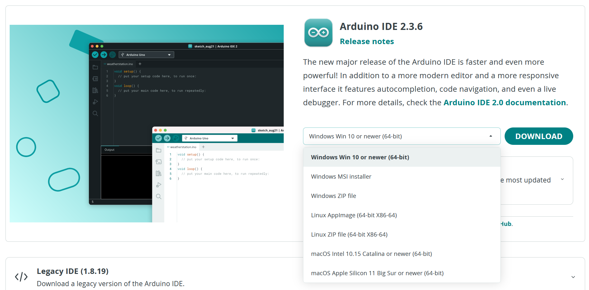
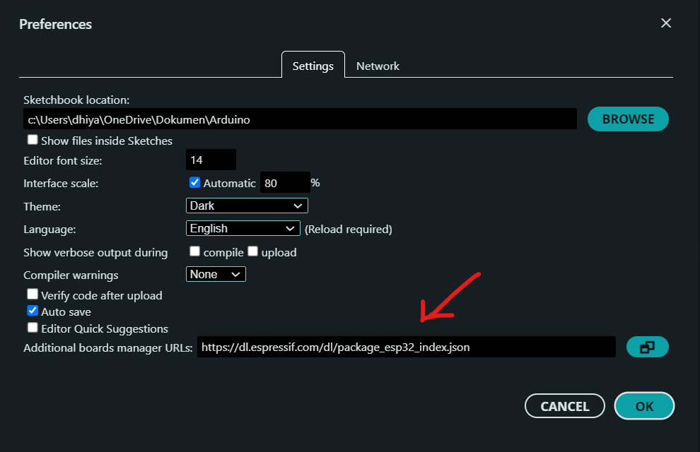
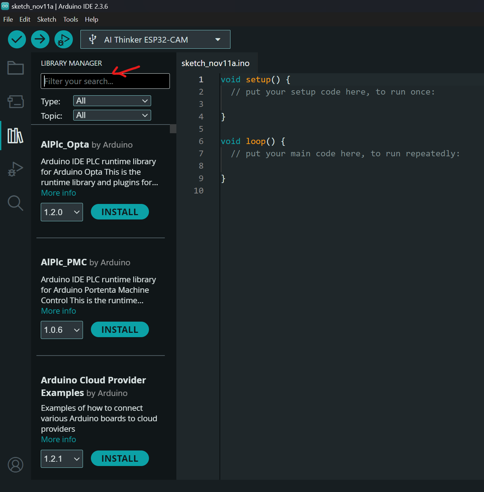
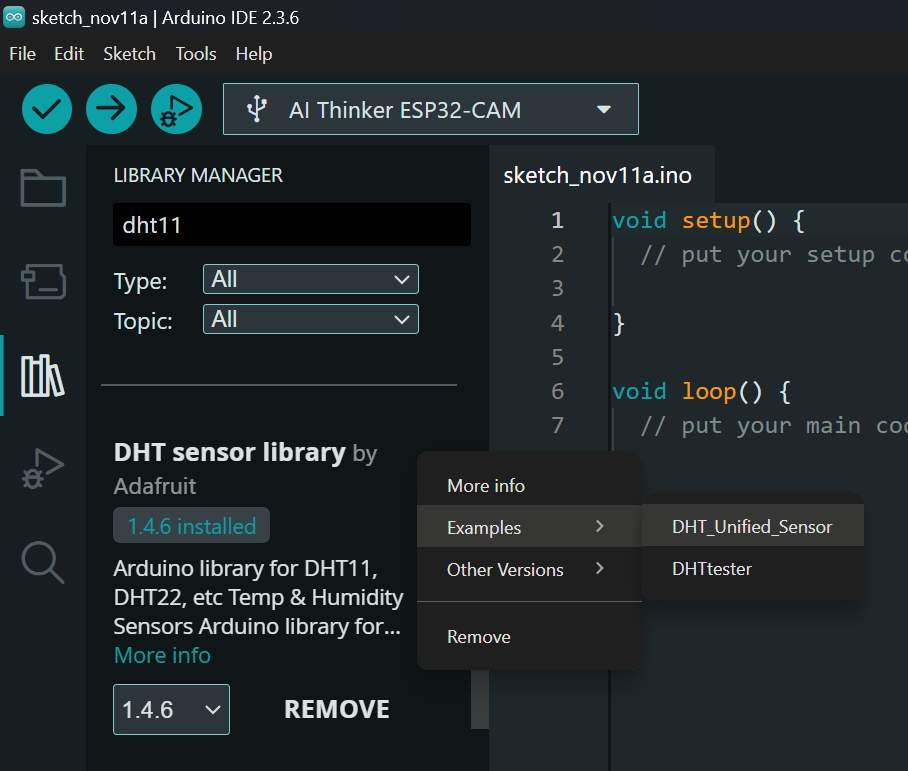
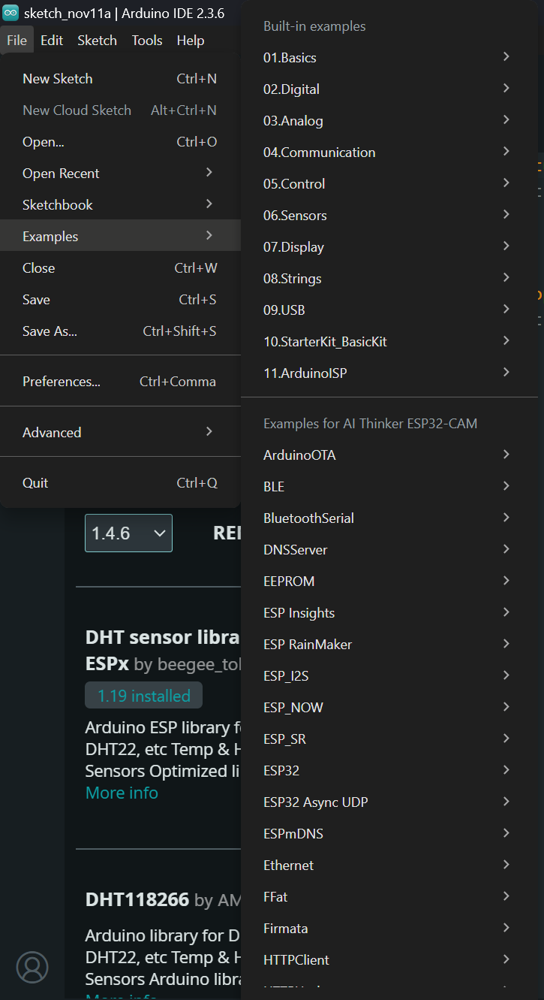

# ⚙️ Instalasi dan Setup Arduino IDE ⚙️
Arduino IDE digunakan untuk menulis, mengompilasi, dan mengunggah program ke mikrokontroler seperti **Arduino**, **ESP32** dan **ESP8266**.  
Dokumen ini menjelaskan langkah-langkah instalasi, setup board, serta uji coba awal.

## 1. Instalasi
> Link software Arduino IDE:   <https://www.arduino.cc/en/software/>      pilih sesuai dengan OS laptop kalian

## 2. Menambahkan Board

1. Buka **File → Preferences**.  
2. Pada kolom **Additional Boards Manager URLs**, tambahkan URL berikut:
    - <https://dl.espressif.com/dl/package_esp32_index.json>

    - <https://arduino.esp8266.com/stable/package_esp8266com_index.json>

## 3. Mengatur Board dan Port

1. Sambungkan **ESP32 / ESP8266** ke komputer menggunakan kabel data USB.  
2. Buka **Tools → Board**, pilih sesuai perangkat:

- ESP32 Dev Module  
- NodeMCU 1.0 (ESP8266)

3. Buka **Tools → Port**, pilih port USB yang sesuai.

## 4. Instal Library Pendukung

Buka **Sketch → Include Library → Manage Libraries...**, lalu cari dan instal:

- `WiFi` / `ESP8266WiFi`
- `PubSubClient`
- `WebSocketsClient`
- `DHT sensor library` by Adafruit
- `Adafruit Unified Sensor`
- `LiquidCrystal_I2C`
- `Servo`

### jika ada kendala dalam installasi boleh dhubungi mentor masing-masing kelompok yah,   RnD IoT 🫶

---
> ## Quick Tip 
> Ketika kita belum tahu cara memulai pemrograman sensor atau aktuator, atau membutuhkan kode untuk pengujian, setiap library biasanya sudah menyediakan contoh program yang bisa dijadikan referensi.
>
>
 
 

>